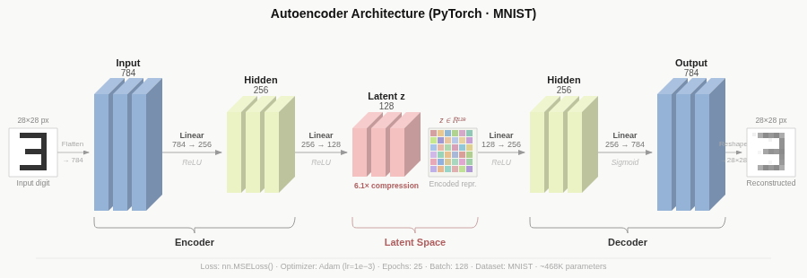
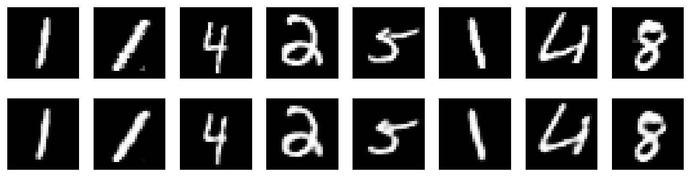
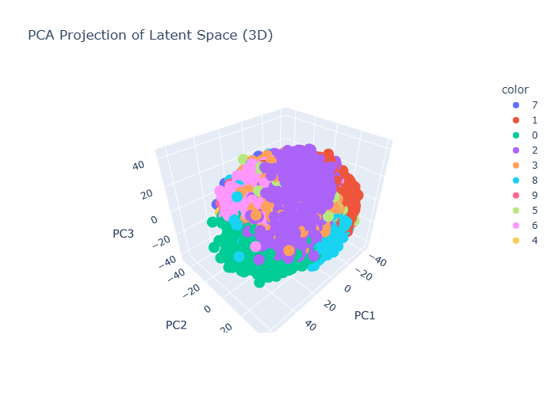
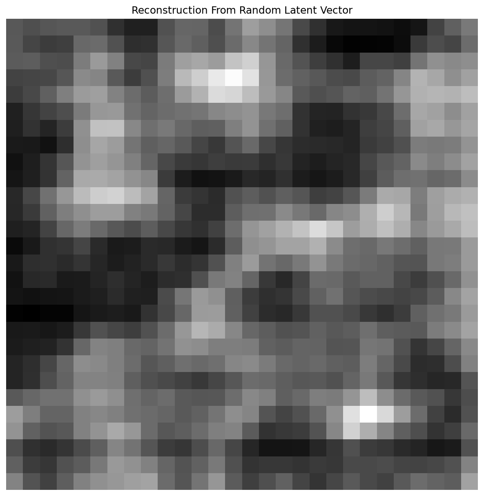
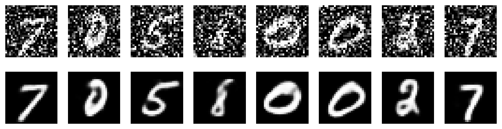

# Autoencoder From Scratch

A notebook-based, from-scratch implementation of a convolutional autoencoder for MNIST in PyTorch — built to learn (and show) how an image gets compressed into a small latent vector and reconstructed back, what that latent space actually looks like, and how a denoising variant behaves differently from a vanilla one.



*Conceptual view of the encoder → latent bottleneck → decoder pattern. This diagram shows the notebook's original fully-connected baseline (784 → 256 → 128 → 256 → 784, ~468K params); the current implementation keeps the same shape but swaps in a convolutional encoder/decoder (see [Model Overview](#model-overview)), which produces sharper reconstructions with ~310K parameters.*

## What It Does

- Loads the MNIST dataset with `torchvision`
- Trains a convolutional autoencoder in PyTorch to compress `28x28` digits into a 128-dimensional latent vector and reconstruct them
- Visualizes original vs. reconstructed digits
- Extracts latent vectors from the encoder and projects them to 3D via PCA for visualization (static + interactive)
- Computes a silhouette score to measure how well digit classes naturally separate in latent space
- Generates a digit from a random latent vector to probe what the decoder does outside the training distribution
- Trains a denoising autoencoder (DAE) on Gaussian-noise-corrupted digits and compares it against the vanilla model

## Results

### Reconstructions



Top row: original MNIST digits. Bottom row: outputs of the trained autoencoder. After 25 epochs, the model converges to an MSE loss of **0.00297**, and reconstructions are visually near-indistinguishable from the originals.

### Latent Space (PCA, 3D)



The encoder maps each digit to a 128-dimensional vector, projected here to 3 dimensions via PCA and colored by digit label. Classes form loose, overlapping clouds rather than tight clusters — expected, since the model is trained purely to reconstruct pixels, with no incentive to separate classes. This matches the measured **silhouette score of 0.0877** computed on the full, un-reduced 128D latent space.

An interactive, rotatable version of this same plot (built with Plotly) is saved at [`results/latent_space_pca_3d.html`](results/latent_space_pca_3d.html) — open it in a browser to pan, zoom, and rotate through the actual point cloud.

### Sampling the Decoder



Decoding a latent vector drawn from `N(0, 1)` — i.e., bypassing the encoder entirely — produces noise rather than a recognizable digit. A vanilla autoencoder has no constraint forcing its latent space to resemble a standard normal distribution (unlike a VAE), so random samples land in regions the decoder never saw during training.

### Denoising Autoencoder



Top row: digits corrupted with Gaussian noise (`noise_factor=0.5`, clipped to `[0, 1]`). Bottom row: reconstructions from a second autoencoder (same architecture, trained from scratch) that is fed the noisy images but always optimized against the *clean* originals. It converges to an MSE loss of **0.01112** against clean targets — higher than the vanilla model's loss, since it's solving a strictly harder task — but recovers clean, legible digit structure from the corrupted input.

## Model Overview

The notebook defines a compact convolutional autoencoder (`AutoEncoder` in [autoencoder_from_scratch.ipynb](autoencoder_from_scratch.ipynb)):

- **Encoder**: three strided `Conv2d` layers downsample `1x28x28 → 16x14x14 → 32x7x7 → 64x4x4`, then a `Linear` layer flattens and projects into a 128-dim latent vector, with `ReLU` activations throughout
- **Decoder**: mirrors the encoder — a `Linear` layer expands the latent vector back to `64x4x4`, followed by three `ConvTranspose2d` layers upsampling back to `1x28x28`, ending in `Sigmoid` to keep pixels in `[0, 1]`
- Trained with `nn.MSELoss()` and the `Adam` optimizer (`lr=1e-3`), batch size 128, for 25 epochs
- ~310K total parameters — fewer than the original fully-connected baseline (~468K) shown in the architecture diagram above, while producing sharper reconstructions

Section 11 of the notebook reuses the exact same architecture to train an independent **denoising autoencoder**: inputs are corrupted with Gaussian noise before the forward pass, but the loss target stays the clean original image.

## Project Files

- [autoencoder_from_scratch.ipynb](autoencoder_from_scratch.ipynb): main notebook containing the model, training loops, and visualizations
- [pyproject.toml](pyproject.toml): project dependencies, managed with [uv](https://docs.astral.sh/uv/)
- [results/](results/): all generated plots and the interactive 3D latent-space visualization

## Requirements

- Python 3.12
- [uv](https://docs.astral.sh/uv/) for dependency and virtual environment management
- An NVIDIA GPU with CUDA 12.4-compatible drivers (optional, falls back to CPU)

## Setup

```bash
uv sync
```

This creates a `.venv` and installs all dependencies, including a CUDA-enabled build of PyTorch.

## How To Run

1. Open [autoencoder_from_scratch.ipynb](autoencoder_from_scratch.ipynb) in Jupyter or VS Code, selecting the `.venv` kernel.
2. Run the notebook cells from top to bottom.
3. Let MNIST download into the local `./data` folder the first time you run it.
4. Review the printed training loss, reconstruction plots, latent-space plots, and the silhouette score.

All generated plots are saved into the `results/` folder:

- `reconstructions.png`: original vs. reconstructed digits
- `latent_space_*.png` / `latent_space_pca_3d.png`: latent-space visualization (filename depends on latent dimensionality; PCA projection used here since `latent_dim=128`)
- `latent_space_pca_3d.html`: interactive, rotatable 3D PCA projection of the latent space (Plotly)
- `random_generation.png`: reconstruction from a random latent vector
- `denoising_reconstructions.png`: noisy inputs vs. denoising-autoencoder reconstructions

## Notes

- The notebook is intended as an educational example rather than a production training pipeline.
